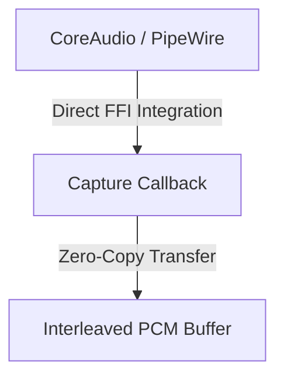

# Cross-Platform Audio Capture Library in Rust


> [!NOTE]
> Tested extensively with rigorous benchmarking and comprehensive CI pipelines to guarantee stability for mission-critical, low-latency audio applications.
## Overview

A zero-dependency, ultra-low latency Rust library for system-level audio capture. This library leverages raw CoreAudio on macOS and PipeWire on Linux (optimized for SteamOS/Arch Linux) to provide developers with direct, hardware-level access to audio streams.

 

## Architecture



## Feature Map

Here is a comprehensive look at the features currently implemented or mapped out in the project roadmap:

### Core Capture Backends
- **macOS Native Capture**: Direct interaction with the `kAudioUnitSubType_HALOutput` AudioUnit graph for absolute minimum latency.
- **Linux Audio Server Integration**: Subprocess fallback mechanisms currently active, with native `libpipewire` bindings in development.
- **Steam Deck / Arch Linux Native**: (Planned) Optimized PipeWire pipeline for gaming-oriented low latency on SteamOS.
- **Windows ASIO Integration**: (Planned) Direct ASIO driver interactions for professional audio capture (low priority).

### High-Performance Architecture
- **Zero-Copy Pipeline**: A strict memory model that completely eliminates intermediate buffer allocations.
- **Embedded & Bare-Metal (`#![no_std]`)**: (Planned) Optional compliance allowing the core to run on microcontrollers without the standard library.
- **SIMD Offloading**: (Planned) Compute-heavy paths delegated to explicit NEON (ARM64) and AVX-512 (x86_64) hardware intrinsics.

### Advanced Orchestration & Networking (Planned)
- **Cross-Language Integration**: Idiomatic, zero-allocation Go bindings (`cgo`) for seamless backend orchestration.
- **Kernel Bypass (`io_uring` & DMA)**: Network I/O optimization utilizing `tokio-uring` and direct memory access to avoid OS bottlenecks.
- **Distributed Microservices**: Scaling audio encoding/processing across Kubernetes clusters via `tonic` (gRPC).
- **Latency Profiling**: Embedded eBPF USDT probes to measure nanosecond-level latencies in production with zero overhead.

### Future Capabilities (Planned)
- **WebAssembly**: Compile to `wasm32-unknown-unknown` for in-browser execution with Web Workers.
- **Hardware-Accelerated Security**: In-stream enterprise-grade encryption via hardware AES-NI.
- **Custom Hardware Targets**: Specialized deployment patterns for Digital Signal Processors (DSPs) and FPGAs.

## Requirements

> [!WARNING]
> Building this project requires a compatible Rust toolchain and platform-specific audio libraries.

- **Rust**: Latest stable toolchain.
- **OS Support**: Cross-platform (macOS, Linux, and SteamOS are heavily prioritized).
- **Dependencies**: Minimal to none (strictly constrained to the Rust standard library where mathematically possible).

## Quick Tutorial

Integration into your existing Rust application is straightforward. Consult the module source for exact API signatures and advanced configurations.

```rust
// 1. Initialize the primary audio capture component
// 2. Supply the required I/O interfaces or PCM buffers
// 3. Execute the processing loop or listener
```
*(Refer to the in-code documentation and `*_test.rs` files for exhaustive initialization examples and constraints).*

## Testing, Fuzzing, and Benchmarking

To run the core test suite and performance benchmarks:
```bash
cargo test
cargo bench
```

To execute the fuzzer for boundary condition testing:
```bash
cargo +nightly fuzz run my_fuzz_target
```

## Local CI Testing

> [!TIP]
> This repository is configured for local, completely free CI testing powered by [OrbStack](https://orbstack.dev/) and [act](https://github.com/nektos/act). We deliberately keep the CI workflow definitions out of `.github/` to prevent remote execution and quota consumption.

To validate the full test suite locally before pushing:
1. Ensure OrbStack is running.
2. Install `act` (e.g., `brew install act`).
3. Run the following command from the repository root:
   ```bash
   act -W .local-ci/workflows
   ```
