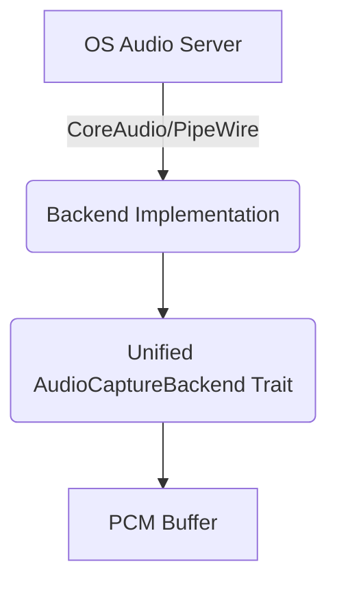

# audio-capture-rs-talaroana


## Overview
Cross-platform audio capture with CoreAudio (macOS) and PipeWire (Linux) backends using zero external dependencies.

## Architecture



## Interface
```rust
// Core exported structs, traits, or functions
```

## Agent Handoff / Continuation
Copied codec/spinoff-capture/. Need to remove workspace reference, add CI actions, and publish.
